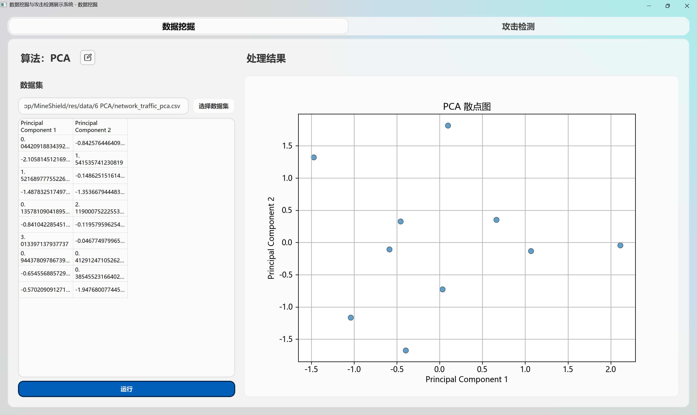

# 数据挖掘

## Dimensionality_Reduction

数据集有乱码

## Linear_Regression

数据集有乱码

## Random_Forest

运行结果无法显示在前端，存在警告

    C:\Users\GaoZQi\Desktop\MineShield\.venv\lib\site-packages\sklearn\metrics\_classification.py:1565: UndefinedMetricWarning: Precision is ill-defined and being set to 0.0 in labels with no predicted samples. Use `zero_division` parameter to control this behavior.
    _warn_prf(average, modifier, f"{metric.capitalize()} is", len(result))
    C:\Users\GaoZQi\Desktop\MineShield\.venv\lib\site-packages\sklearn\metrics\_classification.py:1565: UndefinedMetricWarning: Precision is ill-defined and being set to 0.0 in labels with no predicted samples. Use `zero_division` parameter to control this behavior.
    _warn_prf(average, modifier, f"{metric.capitalize()} is", len(result))
    C:\Users\GaoZQi\Desktop\MineShield\.venv\lib\site-packages\sklearn\metrics\_classification.py:1565: UndefinedMetricWarning: Precision is ill-defined and being set to 0.0 in labels with no predicted samples. Use `zero_division` parameter to control this behavior.
    _warn_prf(average, modifier, f"{metric.capitalize()} is", len(result))

## Isolation_Forest

未提供数据集，根据代码使用鸢尾花数据集进行测试，运行结果异常。

# GMM

无法加载模型，运行报错。

    ┌──(GaoZQi㉿LAPTOP-L9FJ32C7)-[ MineShield]-[~/Desktop/MineShield/src/algorithms]-[main]             0ms  
    └─$ & c:/Users/GaoZQi/Desktop/MineShield/.venv/Scripts/python.exe c:/Users/GaoZQi/Desktop/MineShield/src/algorithms/GMM.py
    Traceback (most recent call last):
    File "c:\Users\GaoZQi\Desktop\MineShield\src\algorithms\GMM.py", line 148, in <module>
        gmm_clustering.load_model()
    File "c:\Users\GaoZQi\Desktop\MineShield\src\algorithms\GMM.py", line 27, in load_model
        self.umap = joblib.load(self.umap_file)  # 加载UMAP模型
    File "C:\Users\GaoZQi\Desktop\MineShield\.venv\lib\site-packages\joblib\numpy_pickle.py", line 658, in load
        obj = _unpickle(fobj, filename, mmap_mode)
    File "C:\Users\GaoZQi\Desktop\MineShield\.venv\lib\site-packages\joblib\numpy_pickle.py", line 577, in _unpickle
        obj = unpickler.load()
    File "C:\Users\GaoZQi\AppData\Roaming\uv\python\cpython-3.10.17-windows-x86_64-none\lib\pickle.py", line 1213, in load
        dispatch[key[0]](self)
    File "C:\Users\GaoZQi\AppData\Roaming\uv\python\cpython-3.10.17-windows-x86_64-none\lib\pickle.py", line 1590, in load_reduce
        stack[-1] = func(*args)
    File "C:\Users\GaoZQi\Desktop\MineShield\.venv\lib\site-packages\numba\core\serialize.py", line 110, in _unpickle__CustomPickled
        ctor, states = loads(serialized)
    TypeError: code expected at most 16 arguments, got 18

# Agglomerative Clustering

与上一个相同

    ┌──(GaoZQi㉿LAPTOP-L9FJ32C7)-[ MineShield]-[~/Desktop/MineShield/src/algorithms]-[main]             0ms  
    └─$ & c:/Users/GaoZQi/Desktop/MineShield/.venv/Scripts/python.exe c:/Users/GaoZQi/Desktop/MineShield/src/algorithms/Agglomerative_Clustering.py
    Traceback (most recent call last):
    File "c:\Users\GaoZQi\Desktop\MineShield\src\algorithms\Agglomerative_Clustering.py", line 169, in <module>
        agglomerative_predict.load_model()
    File "c:\Users\GaoZQi\Desktop\MineShield\src\algorithms\Agglomerative_Clustering.py", line 40, in load_model
        self.umap = joblib.load(self.umap_file)
    File "C:\Users\GaoZQi\Desktop\MineShield\.venv\lib\site-packages\joblib\numpy_pickle.py", line 658, in load
        obj = _unpickle(fobj, filename, mmap_mode)
    File "C:\Users\GaoZQi\Desktop\MineShield\.venv\lib\site-packages\joblib\numpy_pickle.py", line 577, in _unpickle
        obj = unpickler.load()
    File "C:\Users\GaoZQi\AppData\Roaming\uv\python\cpython-3.10.17-windows-x86_64-none\lib\pickle.py", line 1213, in load
        dispatch[key[0]](self)
    File "C:\Users\GaoZQi\AppData\Roaming\uv\python\cpython-3.10.17-windows-x86_64-none\lib\pickle.py", line 1590, in load_reduce
        stack[-1] = func(*args)
    File "C:\Users\GaoZQi\Desktop\MineShield\.venv\lib\site-packages\numba\core\serialize.py", line 110, in _unpickle__CustomPickled
        ctor, states = loads(serialized)
    TypeError: code expected at most 16 arguments, got 18
