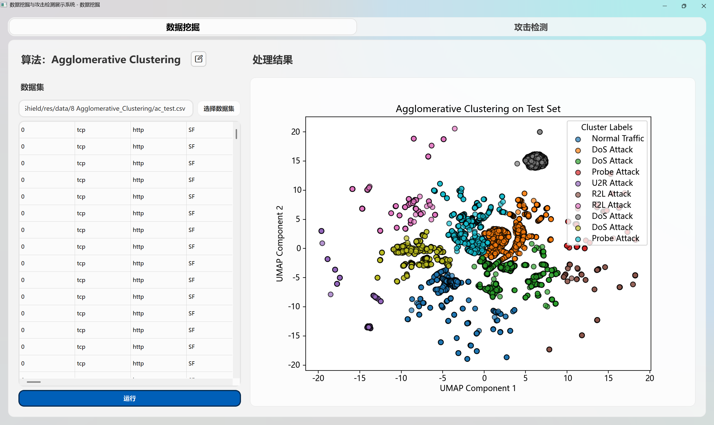
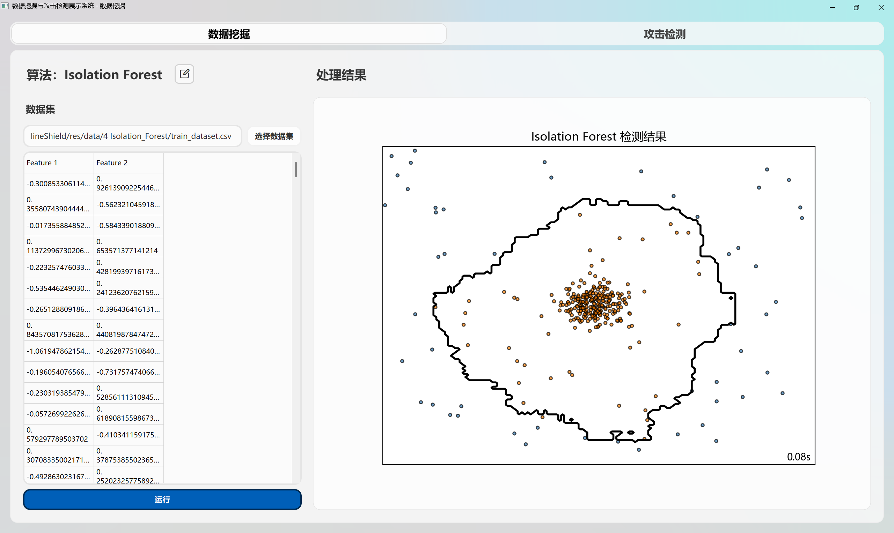
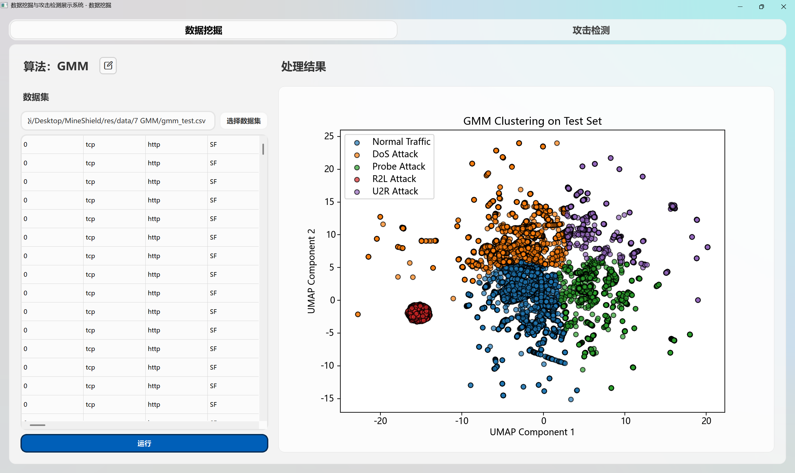
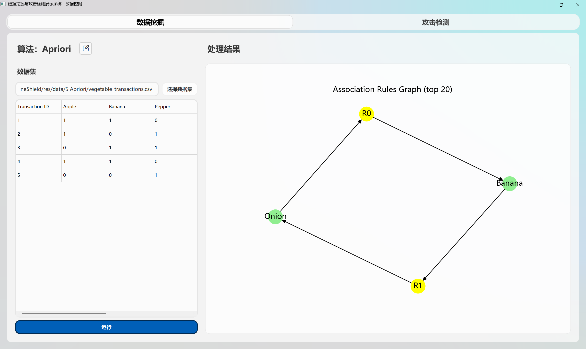

# 前后端对接问题一览表

## 环境信息

requirements.txt

```bash
# This file was autogenerated by uv via the following command:
#    uv pip compile pyproject.toml -o requirements.txt
click==8.1.8
    # via
    #   pyqt5-plugins
    #   pyqt5-tools
    #   qt5-tools
colorama==0.4.6
    # via
    #   click
    #   tqdm
contourpy==1.3.2
    # via matplotlib
cycler==0.12.1
    # via matplotlib
fonttools==4.57.0
    # via matplotlib
joblib==1.4.2
    # via
    #   mineshield (pyproject.toml)
    #   mlxtend
    #   pynndescent
    #   scikit-learn
kiwisolver==1.4.8
    # via matplotlib
llvmlite==0.44.0
    # via
    #   numba
    #   pynndescent
matplotlib==3.10.1
    # via
    #   mineshield (pyproject.toml)
    #   mlxtend
    #   seaborn
mlxtend==0.23.4
    # via mineshield (pyproject.toml)
networkx==3.4.2
    # via mineshield (pyproject.toml)
numba==0.61.2
    # via
    #   pynndescent
    #   umap-learn
numpy==2.2.5
    # via
    #   mineshield (pyproject.toml)
    #   contourpy
    #   matplotlib
    #   mlxtend
    #   numba
    #   pandas
    #   scikit-learn
    #   scipy
    #   seaborn
    #   umap-learn
packaging==25.0
    # via matplotlib
pandas==2.2.3
    # via
    #   mineshield (pyproject.toml)
    #   mlxtend
    #   seaborn
pillow==11.2.1
    # via matplotlib
pynndescent==0.5.13
    # via umap-learn
pyparsing==3.2.3
    # via matplotlib
pyqt5==5.15.9
    # via
    #   mineshield (pyproject.toml)
    #   pyqt5-plugins
    #   pyqt5-tools
pyqt5-plugins==5.15.9.2.3
    # via pyqt5-tools
pyqt5-qt5==5.15.2
    # via
    #   pyqt5
    #   pyqt5-plugins
pyqt5-sip==12.17.0
    # via pyqt5
pyqt5-tools==5.15.9.3.3
    # via mineshield (pyproject.toml)
python-dateutil==2.9.0.post0
    # via
    #   matplotlib
    #   pandas
python-dotenv==1.1.0
    # via pyqt5-tools
pytz==2025.2
    # via pandas
pywin32==310
    # via mineshield (pyproject.toml)
qt5-applications==5.15.2.2.3
    # via qt5-tools
qt5-tools==5.15.2.1.3
    # via pyqt5-plugins
scikit-learn==1.6.1
    # via
    #   mineshield (pyproject.toml)
    #   mlxtend
    #   pynndescent
    #   umap-learn
scipy==1.15.2
    # via
    #   mlxtend
    #   pynndescent
    #   scikit-learn
    #   umap-learn
seaborn==0.13.2
    # via mineshield (pyproject.toml)
six==1.17.0
    # via python-dateutil
threadpoolctl==3.6.0
    # via scikit-learn
tqdm==4.67.1
    # via umap-learn
tzdata==2025.2
    # via pandas
umap-learn==0.5.7
    # via mineshield (pyproject.toml)
win32mica==3.0
    # via mineshield (pyproject.toml)
```

依赖项

```json
dependencies = [
    "joblib>=1.4.2",
    "matplotlib>=3.10.1",
    "mlxtend>=0.23.4",
    "networkx>=3.4.2",
    "numpy>=2.2.5",
    "pandas>=2.2.3",
    "pyqt5>=5.15",
    "pyqt5-tools>=5.15.9.3.3",
    "pywin32>=310",
    "scikit-learn>=1.6.1",
    "seaborn>=0.13.2",
    "umap-learn>=0.5.7",
    "win32mica>=3.0",
]
```

## 数据挖掘 （已解决）

### Dimensionality_Reduction

数据集有乱码


### Linear_Regression（已解决）

数据集有乱码


### K-Means （已解决）

未提供数据集，根据代码选择使用上次作业数据测试。



### Random_Forest

未提供数据集，根据代码选择使用上次作业数据测试。

运行结果无法显示在前端，存在警告





    C:\Users\GaoZQi\Desktop\MineShield\.venv\lib\site-packages\sklearn\metrics\_classification.py:1565: UndefinedMetricWarning: Precision is ill-defined and being set to 0.0 in labels with no predicted samples. Use `zero_division` parameter to control this behavior.
    _warn_prf(average, modifier, f"{metric.capitalize()} is", len(result))
    C:\Users\GaoZQi\Desktop\MineShield\.venv\lib\site-packages\sklearn\metrics\_classification.py:1565: UndefinedMetricWarning: Precision is ill-defined and being set to 0.0 in labels with no predicted samples. Use `zero_division` parameter to control this behavior.
    _warn_prf(average, modifier, f"{metric.capitalize()} is", len(result))
    C:\Users\GaoZQi\Desktop\MineShield\.venv\lib\site-packages\sklearn\metrics\_classification.py:1565: UndefinedMetricWarning: Precision is ill-defined and being set to 0.0 in labels with no predicted samples. Use `zero_division` parameter to control this behavior.
    _warn_prf(average, modifier, f"{metric.capitalize()} is", len(result))

使用 GPT 修改为如下代码

```python
import pandas as pd
import matplotlib.pyplot as plt
import seaborn as sns
from random import randint
from sklearn.feature_extraction.text import TfidfVectorizer
from sklearn.ensemble import RandomForestClassifier
from sklearn.preprocessing import LabelEncoder
from sklearn.model_selection import train_test_split
from sklearn.metrics import classification_report
from sklearn.decomposition import PCA


class MilitaryTextClassifier:
    def __init__(self, file_path, ax, canvas, test_size=0.2, max_features=500):
        self.test_size = test_size
        self.max_features = max_features
        self.label_encoder = LabelEncoder()
        self.vectorizer = TfidfVectorizer(
            max_features=max_features, stop_words="english"
        )
        self.model = RandomForestClassifier(n_estimators=100)
        self.random_seed = randint(0, 999999)

        self.military_map = {
            "drone": "Drone",
            "uav": "Drone",
            "unmanned": "Drone",
            "quadcopter": "Drone",
            "mq-9": "Drone",
            "reaper": "Drone",
            "global hawk": "Drone",
            "loyal wingman": "Drone",
            "ucav": "Drone",
            "suicide drone": "Drone",
            "kamikaze drone": "Drone",
            "missile": "Missile",
            "ballistic": "Missile",
            "interceptor": "Missile",
            "cruise missile": "Missile",
            "hypersonic": "Missile",
            "silo": "Missile",
            "warhead": "Missile",
            "launch vehicle": "Missile",
            "air force": "Air Force",
            "fighter": "Air Force",
            "jet": "Air Force",
            "stealth": "Air Force",
            "f-16": "Air Force",
            "f-35": "Air Force",
            "f-22": "Air Force",
            "bomber": "Air Force",
            "airstrike": "Air Force",
            "navy": "Navy",
            "warship": "Navy",
            "destroyer": "Navy",
            "frigate": "Navy",
            "submarine": "Navy",
            "aircraft carrier": "Navy",
            "carrier strike group": "Navy",
            "army": "Army",
            "tank": "Army",
            "infantry": "Army",
            "ground": "Army",
            "combat": "Army",
            "brigade": "Army",
            "platoon": "Army",
            "artillery": "Army",
            "radar": "Other",
            "sonar": "Other",
            "sensor": "Other",
            "laser": "Other",
            "jamming": "Other",
            "tracking system": "Other",
            "defense": "Defense Systems",
            "air defense": "Defense Systems",
            "iron dome": "Defense Systems",
            "patriot": "Defense Systems",
            "s-400": "Defense Systems",
            "s-300": "Defense Systems",
            "aegis": "Defense Systems",
            "missile shield": "Defense Systems",
            "anti-air": "Defense Systems",
        }
        self.run(file_path, ax, canvas)

    def load_and_prepare_data(self, file_path):
        df = pd.read_csv(file_path)
        print(f"\n✅ 数据读取完成，共 {len(df)} 条新闻。")

        self.military_map = {k.lower(): v for k, v in self.military_map.items()}
        df["military_subcategory"] = (df["title"] + " " + df["content"]).apply(
            lambda text: next(
                (v for k, v in self.military_map.items() if k in str(text).lower()),
                "Other",
            )
        )
        return df

    def run(self, file_path, ax, canvas):
        df = self.load_and_prepare_data(file_path)

        X_text = df["title"] + " " + df["content"]
        X = self.vectorizer.fit_transform(X_text).toarray()
        y = self.label_encoder.fit_transform(df["military_subcategory"])

        X_train, X_test, y_train, y_test = train_test_split(
            X, y, test_size=self.test_size, random_state=self.random_seed
        )

        self.model.fit(X_train, y_train)
        y_pred = self.model.predict(X)

        # PCA降维到2D
        pca = PCA(n_components=2, random_state=42)
        reduced_X = pca.fit_transform(X)

        # 散点图
        scatter = ax.scatter(
            reduced_X[:, 0],
            reduced_X[:, 1],
            c=y_pred,
            cmap="tab10",
            s=50,
            edgecolors="black",
            linewidths=0.5,
            alpha=0.7,
        )
        ax.set_title("Military Text Classification (PCA 2D)")
        ax.set_xlabel("PCA Component 1")
        ax.set_ylabel("PCA Component 2")
        ax.grid(True)
        plt.colorbar(scatter, ax=ax, label="Predicted Category")
        canvas.draw()

        # 控制台输出报告
        target_names = self.label_encoder.inverse_transform(
            sorted(set(y) | set(y_pred))
        )
        print("\n📊 全部数据分类报告：\n")
        print(classification_report(y, y_pred, target_names=target_names))
```

运行效果如下



### Isolation_Forest

未提供数据集，根据代码使用鸢尾花数据集进行测试，运行结果异常。



### Apriori

未提供可视化展示。

使用 GPT 生成如下代码。

```python
import pandas as pd
from mlxtend.frequent_patterns import apriori, association_rules
import networkx as nx
import matplotlib.pyplot as plt


def draw_rule_graph(rules, ax, canva, top_n=20):
    G = nx.DiGraph()
    for i, row in rules.head(top_n).iterrows():
        rule_node = f"R{i}"
        G.add_node(rule_node, color="yellow")
        for a in row["antecedents"]:
            G.add_node(a, color="lightgreen")
            G.add_edge(a, rule_node)
        for c in row["consequents"]:
            G.add_node(c, color="lightgreen")
            G.add_edge(rule_node, c)

    colors = [data["color"] for _, data in G.nodes(data=True)]
    pos = nx.spring_layout(G, k=0.5, seed=42)
    nx.draw(G, pos, with_labels=True, node_color=colors, node_size=500, arrowsize=12)
    ax.set_title(f"Association Rules Graph (top {top_n})")
    canva.draw()


def draw_bubble_chart(rules, ax, canva):
    # rules 是 association_rules() 返回的 DataFrame
    x = rules["support"]
    y = rules["confidence"]
    sizes = rules["lift"] * 20  # 根据 lift 放大气泡
    colors = rules["lift"]  # 也可映射颜色
    scatter = ax.scatter(x, y, s=sizes, c=colors, alpha=0.6)
    ax.set_xlabel("Support")
    ax.set_ylabel("Confidence")
    ax.set_title("Support vs Confidence (bubble size/color ~ Lift)")
    cbar = plt.colorbar(scatter)
    cbar.set_label("Lift")
    canva.draw()
    # plt.grid(True)
    # plt.show()


def run(file_path, ax, canva):
    # 读取卖菜交易数据集
    df = pd.read_csv(file_path)

    # 使用Apriori算法生成频繁项集，设定最小支持度为0.5
    frequent_itemsets = apriori(
        df.drop(columns="Transaction ID"), min_support=0.5, use_colnames=True
    )

    # 生成关联规则，设定最小提升度为1
    rules = association_rules(frequent_itemsets, metric="lift", min_threshold=1)

    # 查看频繁项集和关联规则
    print("频繁项集:")
    print(frequent_itemsets)

    print("\n关联规则:")
    print(rules)

    # 可视化关联规则图
    draw_rule_graph(rules, ax, canva, top_n=20)
    # draw_bubble_chart(rules, ax, canva)


if __name__ == "__main__":
    # 读取卖菜交易数据集
    df = pd.read_csv("../../res/data/Apriori/vegetable_transactions.csv")

    # 使用Apriori算法生成频繁项集，设定最小支持度为0.5
    frequent_itemsets = apriori(
        df.drop(columns="Transaction ID"), min_support=0.5, use_colnames=True
    )

    # 生成关联规则，设定最小提升度为1
    rules = association_rules(frequent_itemsets, metric="lift", min_threshold=1)

    # 查看频繁项集和关联规则
    print("频繁项集:")
    print(frequent_itemsets)

    print("\n关联规则:")
    print(rules)

    # 可视化关联规则图
    fig, ax = plt.subplots(figsize=(10, 6))
    draw_rule_graph(rules, ax, plt, top_n=20)
    plt.show()
```

### GMM

无法加载模型，运行报错。

    ┌──(GaoZQi㉿LAPTOP-L9FJ32C7)-[ MineShield]-[~/Desktop/MineShield/src/algorithms]-[main]             0ms  
    └─$ & c:/Users/GaoZQi/Desktop/MineShield/.venv/Scripts/python.exe c:/Users/GaoZQi/Desktop/MineShield/src/algorithms/GMM.py
    Traceback (most recent call last):
    File "c:\Users\GaoZQi\Desktop\MineShield\src\algorithms\GMM.py", line 148, in <module>
        gmm_clustering.load_model()
    File "c:\Users\GaoZQi\Desktop\MineShield\src\algorithms\GMM.py", line 27, in load_model
        self.umap = joblib.load(self.umap_file)  # 加载UMAP模型
    File "C:\Users\GaoZQi\Desktop\MineShield\.venv\lib\site-packages\joblib\numpy_pickle.py", line 658, in load
        obj = _unpickle(fobj, filename, mmap_mode)
    File "C:\Users\GaoZQi\Desktop\MineShield\.venv\lib\site-packages\joblib\numpy_pickle.py", line 577, in _unpickle
        obj = unpickler.load()
    File "C:\Users\GaoZQi\AppData\Roaming\uv\python\cpython-3.10.17-windows-x86_64-none\lib\pickle.py", line 1213, in load
        dispatch[key[0]](self)
    File "C:\Users\GaoZQi\AppData\Roaming\uv\python\cpython-3.10.17-windows-x86_64-none\lib\pickle.py", line 1590, in load_reduce
        stack[-1] = func(*args)
    File "C:\Users\GaoZQi\Desktop\MineShield\.venv\lib\site-packages\numba\core\serialize.py", line 110, in _unpickle__CustomPickled
        ctor, states = loads(serialized)
    TypeError: code expected at most 16 arguments, got 18


### Agglomerative Clustering

与上一个相同

    ┌──(GaoZQi㉿LAPTOP-L9FJ32C7)-[ MineShield]-[~/Desktop/MineShield/src/algorithms]-[main]             0ms  
    └─$ & c:/Users/GaoZQi/Desktop/MineShield/.venv/Scripts/python.exe c:/Users/GaoZQi/Desktop/MineShield/src/algorithms/Agglomerative_Clustering.py
    Traceback (most recent call last):
    File "c:\Users\GaoZQi\Desktop\MineShield\src\algorithms\Agglomerative_Clustering.py", line 169, in <module>
        agglomerative_predict.load_model()
    File "c:\Users\GaoZQi\Desktop\MineShield\src\algorithms\Agglomerative_Clustering.py", line 40, in load_model
        self.umap = joblib.load(self.umap_file)
    File "C:\Users\GaoZQi\Desktop\MineShield\.venv\lib\site-packages\joblib\numpy_pickle.py", line 658, in load
        obj = _unpickle(fobj, filename, mmap_mode)
    File "C:\Users\GaoZQi\Desktop\MineShield\.venv\lib\site-packages\joblib\numpy_pickle.py", line 577, in _unpickle
        obj = unpickler.load()
    File "C:\Users\GaoZQi\AppData\Roaming\uv\python\cpython-3.10.17-windows-x86_64-none\lib\pickle.py", line 1213, in load
        dispatch[key[0]](self)
    File "C:\Users\GaoZQi\AppData\Roaming\uv\python\cpython-3.10.17-windows-x86_64-none\lib\pickle.py", line 1590, in load_reduce
        stack[-1] = func(*args)
    File "C:\Users\GaoZQi\Desktop\MineShield\.venv\lib\site-packages\numba\core\serialize.py", line 110, in _unpickle__CustomPickled
        ctor, states = loads(serialized)
    TypeError: code expected at most 16 arguments, got 18
