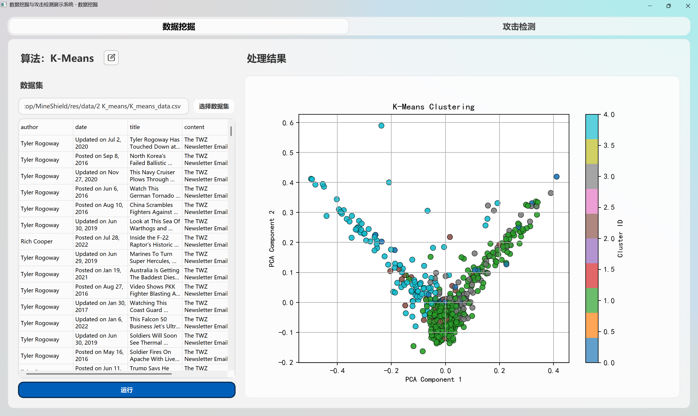
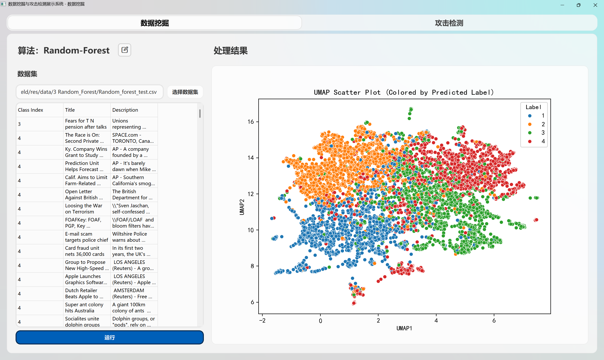

# MineShield

一款展示常见数据挖掘算法和攻击检测方法的可视化工具，旨在帮助用户理解数据挖掘算法的工作原理和应用场景。该工具提供了多种数据挖掘算法的实现，包括分类、聚类、关联规则挖掘等，并通过可视化界面展示算法的运行过程和结果。同时，MineShield 还集成了一些常见的攻击检测方法，帮助用户识别和防范潜在的安全威胁。

## 环境要求

Python 版本要求为 3.10，推荐使用虚拟环境（如 venv 或 conda）来管理依赖。

运行下面指令安装依赖：

```
pip install -r requirements.txt
```

## 使用方法

### 数据挖掘

点击算法信息右侧图标切换数据挖掘算法。


点击选择数据集，选择本地数据集。


选择数据集后，点击“开始”按钮，开始运行数据挖掘算法。


### 攻击检测

点击左侧功能列表选择攻击检测方法。


点击选择文件，上传本地文件。


点击开始检测按钮，开始运行攻击检测方法。


部分功能支持才输入框输入数据，点击左侧按钮进行检测。


## 界面展示

### 数据挖掘算法

-   Dimensionalit Reduction
    
-   Linear Regression
    
-   K-Means
    
-   Random Forest
    
-   Isolation Forest
    
-   Apriori
    
-   PCA
    
-   GMM
    
-   Agglomerative Clustering
    
-   Bayes
    
-   Decision Tree
    

### 攻击检测方法

-   日志检测自动化 SQL 注入
    
-   恶意 URL 请求检测
    
-   恶意邮件检测
    
-   恶意扫描数据包检测
    
-   DDoS 攻击检测
    
-   IDS 入侵检测
    
-   恶意数据包检测
    
-   端口扫描攻击检测
    
-   SQL 注入攻击检测
    
-   XSS 攻击检测
    
